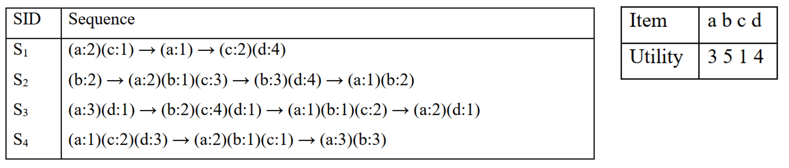

[**P-FCloHUS**](https://doi.org/10.1007/978-981-19-8234-7_31) is a data mining algorithm for extracting <em>frequent-closed high utility sequential patterns</em> from a transactional dataset in parallel on a multicore processor.

<h1>Quick start</h1>

Given a sample transactional dataset with 4 transactions built from a set of items of 4 including `a (or 1)`, `b (or 2)` `c (or 3)` and `d (or 4)` and their corresponding utilities in the second table shown as below: 

First, build the code and containerise it with Docker:

    $ docker build $(pwd) -t pfclohus

Once completed, the mining process can be demonstrated with a minimum support (MIN_SUPP) and minimum utility (MIN_UTIL) by executing the following commands:

    # Set values for minimum support and minimum utility.
    $ MIN_SUPP=3
    $ MIN_UTIL=60

    # Kick off the mining process.
    $ docker run -v $(pwd)/samples:/data/samples --rm pfclohus ${MIN_SUPP} ${MIN_UTIL} /data/samples
    # items: 4, # sequences: 4
    2 3 -1 1 2, supp=3, utility=73
    1 -1 2 -1 1 2, supp=3, utility=92
    4 -1 1 2, supp=3, utility=64
    Total: 3

By default, the P-FCloHUS runs in parallel using all cores on the machine. You can further restrict this behaviour with the `--cpus` option from Docker.
